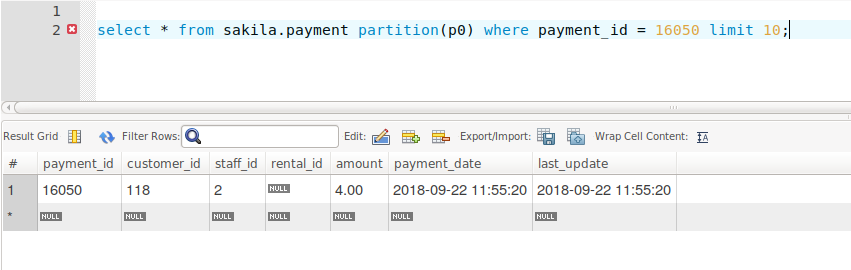
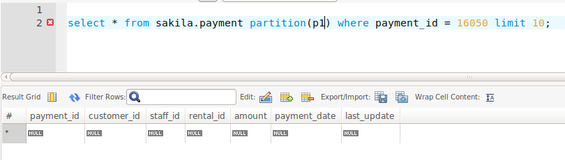

# Tugas 2 BDT
## Partisi Basis Data
### 05111540000118 - Muhammad Faris Didin Andiyar

## Outline
* **Deskripsi server**
* **Implementasi Partisi 1 : Sakila DB**
    * Deskripsi Dataset
    * Proses pembuatan partisi
    * Benchmarking
* **Implementasi Partisi 2 : Measures dataset**
    * Deskripsi Dataset
    * Proses pembuatan partisi
    * Benchmarking

## Deskripsi Server yang digunakan
* **Sistem Operasi** : Ubuntu Server 16.04.5
* **Versi Mysql** : Mysql 5.7.23
* **RAM** : 1024 MB
* **CPU** : 1 core

## Implementasi Partisi 1 : Sakila DB
### Deskripsi dataset
* Dataset ini terdiri dari 23 Tabel.
* Masing - masing tabel memiliki jumlah baris data sebagai berikut :
    
    | Nama Tabel | Jumlah Data|
    | ---------- | ---------- |
    | payment                    |      16049 |
    | rental                     |      16044 |
    | film_actor                 |       5462 |
    | inventory                  |       4581 |
    | film                       |       1000 |
    | film_text                  |       1000 |
    | film_category              |       1000 |
    | address                    |        603 |
    | city                       |        600 |
    | customer                   |        599 |
    | actor                      |        200 |
    | country                    |        109 |
    | category                   |         16 |
    | language                   |          6 |
    | store                      |          2 |
    | staff                      |          2 |
    | nicer_but_slower_film_list |       NULL |
    | customer_list              |       NULL |
    | staff_list                 |       NULL |
    | actor_info                 |       NULL |
    | film_list                  |       NULL |
    | sales_by_store             |       NULL |
    | sales_by_film_category     |       NULL |

### Proses pembuatan partisi
* Pemilihan tabel yang akan dipartisi

    Pemilihan tabel yang akan dipatisi ditentukan berdasarkan jumlah data terbanyak dari keseluruhan tabel serta kemungkinan akan bertambahnya data secara signifikan. Dari tabel sakila tabel yang akan dipartisi adalah tabel payment dan tabel rental.

* Daftar tabel yang akan dipartisi adalah:
    * Tabel payment.
    * Tabel rental.

#### Tabel payment
* Jenis partisi yang digunakan adalah : HASH
* Karena menggunakan partisi HASH maka tidask perlu menentukan predikat partisi.
* Tabel akan dibagi kedalam 5 partisi yakni :
    1. p0 = berisikan record dengan payment_id berakhiran 0 dan 5.
    2. p1 = berisikan record dengan payment_id berakhiran 1 dan 6.
    3. p2 = berisikan record dengan payment_id berakhiran 2 dan 7.
    4. p3 = berisikan record dengan payment_id berakhiran 3 dan 8.
    5. p4 = berisikan record dengan payment_id berakhiran 4 dan 9.

#### Implementasi Partisi

Script yang digunakan untuk partisi tabel payment.

```SQL
CREATE TABLE payment (
  payment_id SMALLINT UNSIGNED NOT NULL AUTO_INCREMENT,
  customer_id SMALLINT UNSIGNED NOT NULL,
  staff_id TINYINT UNSIGNED NOT NULL,
  rental_id INT DEFAULT NULL,
  amount DECIMAL(5,2) NOT NULL,
  payment_date DATETIME NOT NULL,
  last_update TIMESTAMP DEFAULT CURRENT_TIMESTAMP ON UPDATE CURRENT_TIMESTAMP,
  PRIMARY KEY  (payment_id),
  KEY idx_fk_staff_id (staff_id),
  KEY idx_fk_customer_id (customer_id)
--  CONSTRAINT fk_payment_rental FOREIGN KEY (rental_id) REFERENCES rental (rental_id) ON DELETE SET NULL ON UPDATE CASCADE,
--  CONSTRAINT fk_payment_customer FOREIGN KEY (customer_id) REFERENCES customer (customer_id) ON DELETE RESTRICT ON UPDATE CASCADE,
--  CONSTRAINT fk_payment_staff FOREIGN KEY (staff_id) REFERENCES staff (staff_id) ON DELETE RESTRICT ON UPDATE CASCADE
)ENGINE=InnoDB DEFAULT CHARSET=utf8;

ALTER TABLE payment
	PARTITION BY HASH (payment_id)
	PARTITIONS 5;
```

Script yang digunakan untuk partisi tabel rental.

```SQL
CREATE TABLE rental (
  rental_id INT NOT NULL AUTO_INCREMENT,
  rental_date DATETIME NOT NULL,
  inventory_id MEDIUMINT UNSIGNED NOT NULL,
  customer_id SMALLINT UNSIGNED NOT NULL,
  return_date DATETIME DEFAULT NULL,
  staff_id TINYINT UNSIGNED NOT NULL,
  last_update TIMESTAMP NOT NULL DEFAULT CURRENT_TIMESTAMP ON UPDATE CURRENT_TIMESTAMP,
  PRIMARY KEY (rental_id),
  UNIQUE KEY  (rental_id,staff_id,inventory_id,customer_id),	
  KEY idx_fk_inventory_id (inventory_id),
  KEY idx_fk_customer_id (customer_id),
  KEY idx_fk_staff_id (staff_id)
--  CONSTRAINT fk_rental_staff FOREIGN KEY (staff_id) REFERENCES staff (staff_id) ON DELETE RESTRICT ON UPDATE CASCADE,
--  CONSTRAINT fk_rental_inventory FOREIGN KEY (inventory_id) REFERENCES inventory (inventory_id) ON DELETE RESTRICT ON UPDATE CASCADE,
--  CONSTRAINT fk_rental_customer FOREIGN KEY (customer_id) REFERENCES customer (customer_id) ON DELETE RESTRICT ON UPDATE CASCADE
)ENGINE=InnoDB DEFAULT CHARSET=utf8;

ALTER TABLE rental 
	PARTITION BY HASH(rental_id)
	PARTITIONS 5;
```
#### BENCHMARKING
Karena partisi yang digunakan adalah hash dari payment_id dan merupakan kolom yang auto increment, untuk insert data tidak perlu spesifik ke tabel partisi. Cukup dengan insert langsung ke tabel utama data akan otomatis dimasukkan ke dalam partisi sesua dengan payment id.

Memasukkan record baru ke dalam tabel 
```SQL
insert into sakila.payment (customer_id, staff_id, rental_id, amount, payment_date) values
(118,2,null,'4.00','2018-09-22 11:55:20'),
(118,2,null,'4.07','2016-09-22 12:23:00'),
(118,2,null,'4.21','2016-09-22 13:23:00'),
(118,2,null,'4.11','2016-09-22 13:25:00'),
(118,2,null,'3.20','2016-09-22 13:30:00'),
(118,2,null,'2.20','2016-09-22 14:00:00'),
(118,1,null,'3.20','2016-09-22 14:50:00'),
(118,1,null,'5.20','2016-09-22 14:59:00'),
(118,1,null,'1.23','2016-09-22 15:10:00'),
(118,1,null,'3.21','2016-09-22 15:19:00');

```
cek record (data dalam tabel)
1. cek data yang ada dalam tabel.
```SQL
select * from sakila.payment partition(p0) where payment_id = 16050 limit 10;
```
hasilnya : 


karena payment_id berakhiran angka 0 dan partisi yang dipilih ada 'p0' maka record dapat ditampilkan.

2. Cek data yang tidak ada dalam tabel.
```SQL
select * from sakila.payment partition(p1) where payment_id = 16050 limit 10;
```
hasilnya :


karena payment_id berakhiran angka 0 dan partisi yang dipilih ada 'p1' maka tidak ada yang ditampilkan (kosong).

## Implementasi Partisi 2 : measures dataset
### Deskripsi Dataset
* dataset terdiri dari dua tabel yakni :
    * measures
    * measures_partitioned (bentuk partisi dari tabel measures)

* sumber dataset
    http://www.vertabelo.com/blog/technical-articles/everything-you-need-to-know-about-mysql-partitions 

### Import Dataset
1. Download dataset dari yang disebutkan diatas.
2. masuk ke command line mysql 
    ```bash
        mysql -u root -p
    ```
3. buat database bernama measures
    ```sql
        CREATE DATABASE measures;
    ```
4. keluar dari command line mysql.
5. import database yang sudah didownload.
    ```SQL
        mysql -u root -p -D measures < {nama file sql}
    ```
    contoh file sql bernama sample_measure.sql
    ```SQL
        mysql -u root -p -D measures < sample_measure.sql
    ```

### BENCHMARKING

#### SELECT
|No.|Tabel Tanpa Partisi | Tabel dengan Partisi|
|---|---|---|
|1|1,840|1,110|
|2|1,101|0,780|
|3|0,960|0,692|
|4|0,986|0,689|
|5|0,998|0,657|
|6|1,011|0,688|
|7|1,003|0,628|
|8|0,967|0,669|
|9|0,922|0,688|
|10|0,919|0,619|
|Rata-rata|1,0707|0,722|

#### BIG DELETE
|No.|Tabel Tanpa Partisi | Tabel dengan Partisi|Rows|
|---|---    |---    |---|
|1.|1,021	|0,128	|85314|
|2.|1,297	|0,276	|85314|
|3.|1,228	|0,125	|85314|
|4.|1,250	|0,258	|85314|
|5.|1,295	|0,200	|85314|
|6.|1,262	|0,130	|85314|
|7.|1,391	|0,106	|85314|
|8.|1,447	|0,274	|85314|
|9.|1,283	|0,165	|85314|
|10.|1,374	|0,132	|85314|
|Rata - rata|1,285	|0,179	|85314|
### CONCLUSION
* dari percobaan select dapat disimpulkan bahwa select dari tabel yang dipartisi lebih cepat (hampir 2 kali lebih cepat) daripada select dari tabel tanpa partisi.
* dari percobaan big delete dapat disimpulkan bahwa delete data yang banyak lebih cepat menggunakan tabel yang dipartisi karena cukup dengan drop partisi yang ingin dihapus.